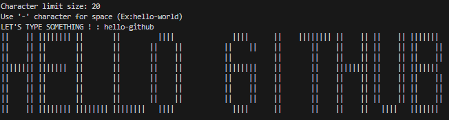

## TerminalText
Write text art on the terminal with C language.

You should type only alphabet character and use '-' character for space.

Default character limit 20 and changeable.

### GCC
```
# gcc -o run .\TerminalText\terminal.c
```
## Output

